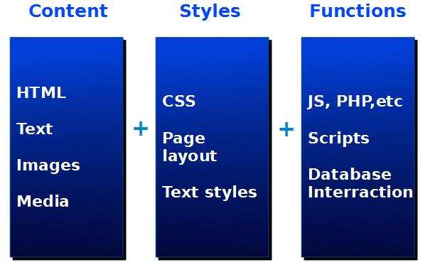
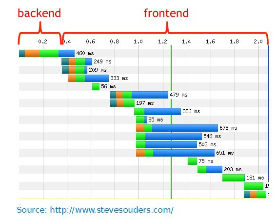

# 1.0 Assets Management

#### What are assets?

A web page consists of a base HTML document and any additional files it may include, such as stylesheets, scripts, images and fonts. We will refer to these additional files as **assets**.

**Most of the focus in XOOPS asset management is on stylesheet and script assets.**

Assets are a very important part of the user experience.
For today's rich, highly interactive web applications, the asset performance may be more significant than the backend application and database performance.

**Assets Performance Factors**

There are several factors that influence the performance of assets:

* Asset size
* Number of files
* Latency
    * Network speed
        * Connection set up an tear down
        * Transfer rate
        * Currency limits
    * Client capacity
        * Processing power/load
        * Memory
        * Cache speed* 

In order to address these issues, and to minimize the impact, there are different strategies for Assets Management:

* Minimize file sizes
* Combine files to reduce network connections
* Serve assets as static files to maximize caching
* Avoid concurrency bottlenecks
    * Assets that include other assets when loaded

Of course, there are different strategies for Development, and different for Deployment:

| Develop / Debug | Deployment Focus |
| -- | -- |
| Easy to read and edit is essential | Eliminate formatting and whitespace|
| Separate files are easier to work with and may come from different sources|Combine files to eliminate latency  |

**Asset management solves the development vs. deployment dilemma by using the exact  same sources for both needs.**

