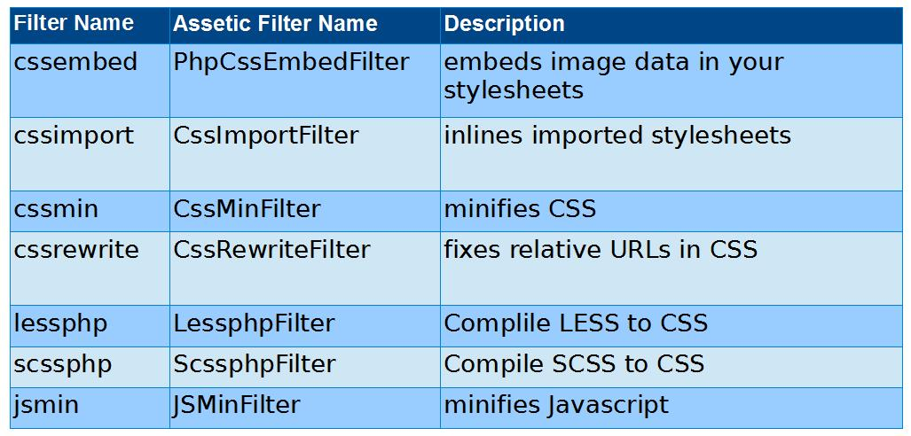
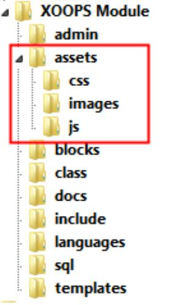

# 2.0 Assets: the Basics

**Asset Management allows you to:**

* Specify a file or set of files as an asset
* Specify filters to apply to that asset
* Create a static file from the asset for the browser to load which :
    * Contains the content of all the specified files
    * Has all the specified filters applied
    * Is transferred as a single unit


XOOPS Asset Management is built on Assetic, by Kris Wallsmith. 

For a deeper understanding of some of the concepts, review the documentation available at:

https://github.com/kriswallsmith/assetic

Let's dive now deeper to get better understanding of the Asset files:

* An asset can be a set of script or stylesheet files, not both
* An asset is defined by an array of file specifications
* A file can be specified by a fully qualified filesystem name, or by a path resolvable by the XOOPS path() function
* A file specification can also be a wildcard pattern


**XOOPS Asset Management** comes configured with a subset of the possible **Assetic filters**. One major criteria for the selection of these filters is they are **all implemented in PHP and require no additional binary packages to be installed on the server.** These filters are portable and will be available for use where ever XOOPS is installed. 

Filters are specified as a string of comma separated filter names.  A filter name can be preceded with a question mark (“?”) to turn it off during debugging.

These are the available filters:



If no filters are specified, default filters will be applied.

Stylesheets
```
'cssimport,cssembed,?cssmin'```


Javascript
```
'?jsmin'```

**Assets Location: Core**

Managed assets are stored in the “assets” directory in the XOOPS web root
* stylesheets in css sub-directory
* scripts in js sub-directory

These managed directories can be cleared, and contents will be recreated as needed

Other subdirectories, such as fonts, are managed differently

**Assets Location: Core**

Module's Assets are also placed in an “assets” folder, similar to Core
In order to take advantage of Assetic, current modules should convert to this folder structure 



#### Lazy Management

* Each page load specifies the set of assets it needs
* The lists of files, modification times, and filters to apply are used to build unique asset names
* If the static file with that name does not exist, the asset files are processed and filtered, and the static file is created
* There are no separate formula extraction or preprocessing steps needed


