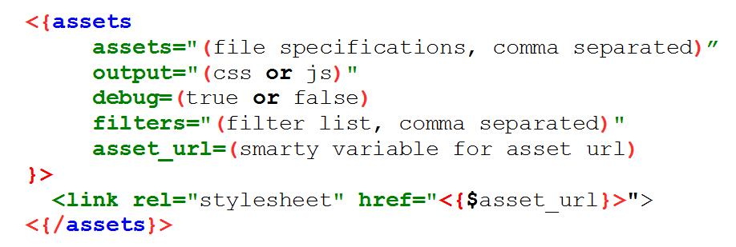

# 4.0 Base Assets

* XOOPS Core uses the base assets for common system wide assets, such as jQuery, jQueryUI, locale and Bootstrap assets

* Themes can add to the base assets using **theme_onload.php**

* Modules may want to add their common assets to the base asset

* Browser cache use is improved if the same base asset definition is used for many pages


**setNamedAsset**

Accepts a unique asset name
Accepts an array of one or more asset file  specifications
Optionally accepts a string of comma separated filter names
Results in creating an asset **reference** that can be specified in asset arrays in place of a file specification

#### Name Assets

Named assets allow symbolic reference to commonly used assets (i.e. “jquery”)
Named assets can be given additional filters

Using setNamedAsset does not create the asset, it just records the name and definition

To use an asset named “jquery” include an asset name of “@jquery” in an asset list

#### Smarty Assets Tag

The Smarty block plugin allows assets to be defined in templates. Full syntax:



**Assets Tag Argument:**


| Tag | Meaning |
| -- | -- |
|assets | comma separated list of assets to process.
|output  | type of output, “css” or “js”
|debug | true to enable debug mode, default is false
|filters |  list of  filters to apply, if not specifed will use default filters for output type
|asset_url  | smarty variable to assign asset path, defaults to “asset_url”

#### Behind the Scenes

* Xoops\Core\Assets.php handles communication with the Assetic library
* Xoops object establishes a single instance of Assets class, and XoopsTheme references it
* Configuration of Assets class is in  ***xoops_path/configs/system_assets_prefs.yml***, but it normally should not need to be changed

**copyFileAssets()**

To handle fonts and images in some special circumstances, a file copy function is provided.
 
```
Xoops\Core\Assets::copyFileAssets()
```

This method copies files to the asset directory. Copying is normally only needed for fonts or images when they are referenced by a relative URL in a stylesheet, or are located outside of the web root, as might be the case of a file asset located in a vendor package.

#### Turning on Debug

* Easiest way is to include ASSET_DEBUG=1 in the URL, i.e. index.php?ASSET_DEBUG=1
* Add this call to your code: 

```
\Xoops::getInstance()->assets()->setDebug(true);
```

* Add **debug=true** to a Smarty assets tag
* Any of these will turn off any filters prefixed with a question mark (by default cssmin and jsmin)

#### Examples


You probably would like to see some examples of the Assets Management. 

**The best source of Asset Management examples is XOOPS 2.6.0 itself.**

